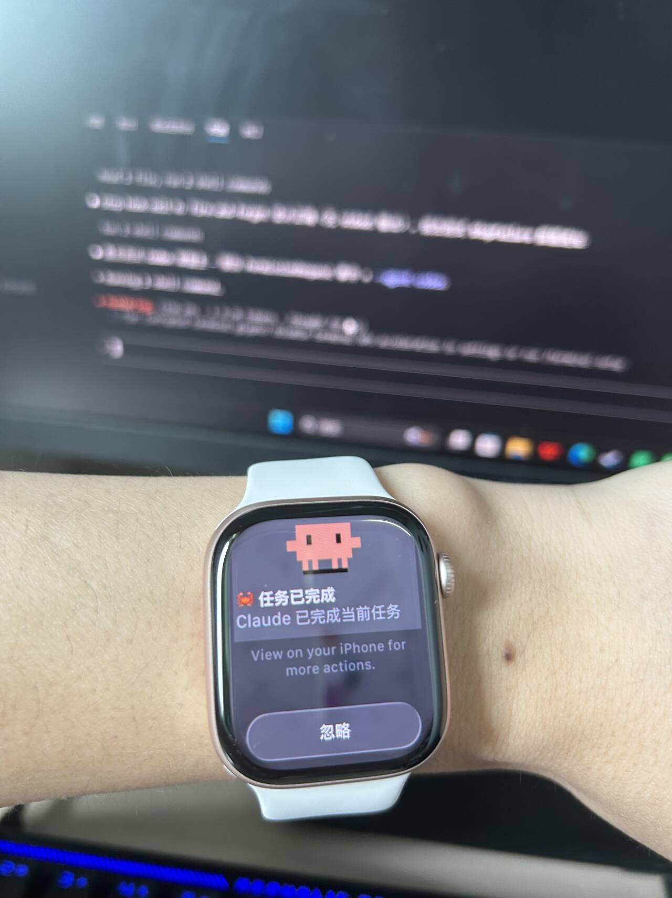
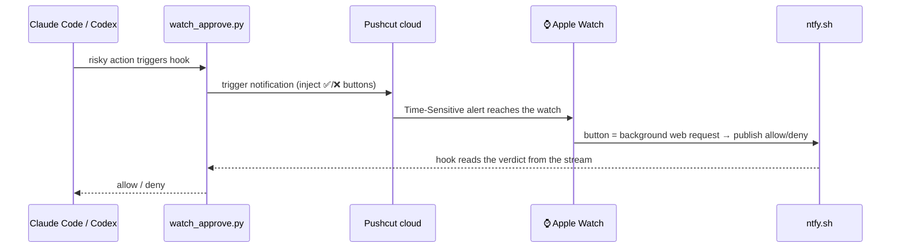

<div align="center">

# ⌚ agent-watch-approve

**Your AI codes, you relax: approve risky actions from your wrist, get buzzed when the job is done.**

Routes **Claude Code** and **Codex** approval requests to your **Apple Watch / iPhone**
with ✅ Allow / ❌ Deny buttons, and pings you when each task finishes — no terminal babysitting.

[](https://github.com/ghy196830-del/agent-watch-approve/actions)
[](./LICENSE)


**[中文文档](./README.md)**


| Claude Code notifications | Codex notifications |
|:---:|:---:|
|  |  |

</div>

## 📺 See it in action

<div align="center">
   watch buzz -> one tap to approve">
  <br>
  <sub>Risky action → watch buzzes → ✅ one tap, the agent keeps going</sub>
</div>

▶️ **[Full intro video (30s)](./assets/showcase/intro.mp4)** — plays right on GitHub

### Feature gallery

| | | |
|:---:|:---:|:---:|
| [](./assets/showcase/card-claude-approve.jpg) | [](./assets/showcase/card-codex-approve.jpg) | [](./assets/showcase/card-hook-protect.jpg) |
| Risky commands ask you first | Codex CLI works the same | Even editing the hook needs approval |
| [](./assets/showcase/card-task-done.jpg) | [](./assets/showcase/card-rate-limit.jpg) | [](./assets/showcase/card-terminal-forced.jpg) |
| Done? Your wrist knows | Quota alerts, instantly | A heads-up even when the terminal must confirm |

### 📸 Real-device photos

<div align="center">
  
  
  
  <br>
  <sub>Left: Claude asks to delete a folder · Middle: Codex asks to git push · Right: task done — a glance at the wrist is all it takes</sub>
</div>

---

## What it does

1. **⌚ Remote approval** — risky actions (`rm -rf`, `git push --force`, privilege escalation, sandbox escapes…) push a notification with **Allow / Deny** buttons to your watch; your tap flows back to the agent in seconds.
2. **🔔 Done notifications** — every time the agent finishes a turn, your wrist buzzes "task complete".
3. **🚦 Usage-limit alerts** — get notified the moment your subscription quota runs out (Claude) or is about to (Codex, ≥90% warning by default), with the reset time; turns killed by API errors alert you too.
4. **🤖 Autopilot for the rest** — non-risky operations are silently auto-approved (configurable), so the terminal never prompts again.

Two Python scripts, **standard library only, zero dependencies**, and **fail-safe end to end**: missing config, network failure, or timeout all fall back to the agent's normal in-terminal prompt — your run never hangs.



## Requirements

- **Claude Code** and/or **Codex CLI**
- **Python 3** on PATH (stdlib only — nothing to `pip install`)
- A **[Pushcut](https://www.pushcut.io/)** account (**Pro** for dynamically-injected buttons), app installed on iPhone **and Apple Watch**
- An **[ntfy](https://ntfy.sh/)** topic (public ntfy.sh is fine — **the topic name is the password, make it long and random**)
- (Optional) a local HTTP proxy such as `http://127.0.0.1:7890` if your network needs one

## Setup in 10 minutes

### Step 0 — Pushcut & ntfy

1. In Pushcut, create a Notification (any name → goes into `PUSHCUT_NOTIF`). Leave title/text/actions empty — the hook overrides them dynamically.
2. Grab your API key from **Account → API**.
3. Pick a long random ntfy topic, e.g. `myagent_8f3k2j9x` (nothing to register).

### Step 1 — Install the scripts

Put `watch_approve.py`, `watch_done.py` and `watch.env` in a **stable folder**, e.g. `~/watch-hooks/`:

```bash
git clone https://github.com/ghy196830-del/agent-watch-approve.git
cp agent-watch-approve/watch_approve.py agent-watch-approve/watch_done.py ~/watch-hooks/
cp agent-watch-approve/watch.env.example ~/watch-hooks/watch.env   # then fill in your key/topic
```

> **Why `watch.env`?** Hook processes inherit env vars from whoever launched the agent, and Codex
> does **not** pass its configured env to hooks. The scripts read `watch.env` next to themselves as a
> fallback (it only fills in *missing* variables — real env vars always win), so they work no matter
> where the agent was launched from.

### Step 2 — Wire up Claude Code

Merge [`examples/claude/settings.example.json`](./examples/claude/settings.example.json) into
`~/.claude/settings.json` (global) or your project's `.claude/settings.json`, fixing the absolute
script paths. Restart Claude Code.

Two hooks: `PreToolUse` (approval) + `Stop` (done notification), with `"matcher": "*"` for the
autopilot setup described below.

### Step 3 — Wire up Codex

Put [`examples/codex/hooks.example.json`](./examples/codex/hooks.example.json) at `~/.codex/hooks.json`,
fixing the absolute script paths.

**Three Codex-specific gotchas (all learned the hard way):**

1. **Approval hangs off the `PermissionRequest` event, not `PreToolUse`.** Codex fires it exactly when
   it would ask you for approval (escalation / sandbox escape / network…); the hook answers allow/deny,
   and answering nothing falls back to the normal terminal prompt. (Codex's `PreToolUse` does *not*
   intercept the newer unified shell calls and doesn't support `ask` — don't use it for approvals.)
2. **Hooks must be reviewed & trusted before they run, and re-trusted after every edit** — otherwise
   they are **silently skipped** with no error. In the Codex TUI run **`/hooks`**, review and trust both entries.
3. **`codex exec` (non-interactive) never fires `PermissionRequest`** (its approval policy is `never`).
   Test approvals in an interactive session; the `Stop` hook does fire under exec.

### Step 4 — Smoke-test without the agent

```bash
# Claude style (PreToolUse):
echo '{"hook_event_name":"PreToolUse","tool_name":"Bash","tool_input":{"command":"rm -rf /tmp/x"}}' \
  | python ~/watch-hooks/watch_approve.py

# Codex style (PermissionRequest):
echo '{"hook_event_name":"PermissionRequest","tool_name":"Bash","tool_input":{"command":"git push --force"}}' \
  | python ~/watch-hooks/watch_approve.py --agent codex

# Done notification:
python ~/watch-hooks/watch_done.py < /dev/null
```

Tap **✅ Allow** on the watch: the first command prints `permissionDecision: "allow"`, the second prints
`decision: {"behavior": "allow"}` — the script switches output format automatically per event.

> ⚠️ With danger-only enabled (the recommended default), test with a **risky** command — a plain
> `echo hello` won't notify by design.

## Autopilot mode (recommended)

The defaults in `watch.env.example` implement "**only danger interrupts me, everything else just runs**":

```
WATCH_DANGER_ONLY=1            # only danger-list matches go to the watch
WATCH_NONDANGER_DECISION=allow # everything else is approved silently
```

Combined with Claude Code's `"matcher": "*"`, **every** tool call routes through the hook: non-risky
ones (reads, searches, MCP calls…) pass silently, only real danger buzzes your wrist. Why not a narrow
matcher? A whitelist always misses the next new tool (`WebSearch`, new MCP tools…), and missed tools
fall back to the **terminal** prompt your watch will never see.

The built-in danger list flags `rm -rf`, `sudo`, `git push --force`, `git reset --hard`, `dd`, `mkfs`,
`chmod 777`, `shutdown`, `kill`, `DROP/TRUNCATE TABLE`, `DELETE FROM`, `curl | sh`, `docker rm/prune`,
`terraform destroy`, `kubectl delete`, PowerShell `Remove-Item -Recurse -Force`, and more.
Extend with `WATCH_DANGER_EXTRA`, or replace wholesale with `WATCH_DANGER_REGEX`.

> ⚠️ Understand the trade-off: with `allow`, anything the danger list does **not** catch runs without
> confirmation. The danger regex is your only gate — review and extend it.

**The watch shows a human-readable verdict, not raw commands** — a category label plus the target's
basename, e.g. `🗑️ delete folder: node_modules`, `⚠️ git force push: main`, `📝 edit files: app.py, readme.md`.

**Anti-tamper:** set `WATCH_PROTECT_PATHS=watch-hooks` and any *write* to the scripts' folder is itself
forced onto the watch (🛡️) — the agent can't quietly edit your gate away.

## Usage-limit alerts (a must for subscription plans)

Both Claude Code and Codex subscriptions have usage windows — when they run dry your task silently
dies while you're away. That's now on your wrist too, via two different mechanisms (both verified):

- **Claude**: hangs off the official **`StopFailure`** hook (runs *instead of* Stop when a turn ends
  on an API error). Limit errors (`error=rate_limit`) → "**🚦 Claude quota exhausted**" with the reset
  time extracted from the error text (e.g. `resets 1:10am`); other API errors → "**⚠️ turn failed**"
  with the error type.
- **Codex**: a turn that dies on a usage-limit error runs **no hooks at all** (confirmed in source —
  the error path breaks before stop hooks), so instead you get an **early warning**: at every normal
  turn end the script reads Codex's own quota telemetry (`rate_limits` in the rollout, with
  `used_percent` and reset time). At ≥ `WATCH_LIMIT_WARN_PCT` (default **90%**) the done notification
  becomes "**⚠️ Codex quota at NN%**" + reset time — you're warned *before* it burns out.
- These alerts use a distinct sound (`WATCH_LIMIT_SOUND`, default `problem`) so your ear can tell
  them from normal done pings.

Wiring: for Claude add a `StopFailure` block to your settings hooks (the example includes it);
Codex needs nothing extra (it rides the existing Stop hook).

## Per-agent look

One script serves both agents (switch via `--agent codex` or `WATCH_AGENT=codex`):

| | Title | Image (transparent banner via jsDelivr CDN) |
|---|---|---|
| **Claude Code** | 🦀 Claude pending approval / task done | Official pixel crab **Clawd**, animated GIF |
| **Codex** | 🤖 Codex pending approval / task done | GPT knot-cat (`assets/gpt-cat.png`; official knot logo `gpt-logo.png` also included) |

Override with `PUSHCUT_IMAGE=<url>` (applies to both agents), or `none` to drop the image.

## Configuration reference (env vars / watch.env)

**Core**

| Variable | Default | Description |
|----------|---------|-------------|
| `PUSHCUT_KEY` | — | **Required.** Pushcut API key |
| `NTFY_TOPIC` | — | **Required.** Return-channel topic (acts as the password) |
| `PUSHCUT_NOTIF` | `claude` | Name of the Pushcut notification to trigger |
| `HTTPS_PROXY` | — | Outbound proxy, e.g. `http://127.0.0.1:7890` (falls back to `HTTP_PROXY`) |
| `WATCH_AGENT` | `claude` | `claude` / `codex`; the `--agent` CLI flag wins over this |
| `WATCH_ENV_FILE` | `watch.env` next to the script | Fallback config file path |

**Delivery (the three things that make the watch actually buzz)**

| Variable | Default | Description |
|----------|---------|-------------|
| `PUSHCUT_DEVICES` | (all devices) | **Recommend `iPhone,watch`** — target the watch directly, bypassing iOS mirroring rules (names via Pushcut `GET /v1/devices`) |
| `PUSHCUT_SOUND` | `default` | **No sound = no vibration on the watch!** `vibrateOnly` = buzz without sound, `none` = silent |
| `PUSHCUT_TIME_SENSITIVE` | `1` | Time-Sensitive alert: reaches the **watch even while the iPhone is in use**, and breaks through Focus/DND (the single most effective lever, A/B-tested) |

**Approval behavior**

| Variable | Default | Description |
|----------|---------|-------------|
| `APPROVE_WAIT` | `240` | Seconds to wait for the tap (keep below the hook timeout of 300) |
| `APPROVE_TIMEOUT_DECISION` | `ask` | If nobody answers: `ask` (defer to terminal) / `allow` / `deny` |
| `WATCH_DANGER_ONLY` | `0` | `1` = only risky operations go to the watch |
| `WATCH_NONDANGER_DECISION` | `ask` | In danger-only mode, non-risky ops: `ask` / `allow` / `deny` |
| `WATCH_DANGER_EXTRA` | — | Extra danger regexes (newline-separated) |
| `WATCH_DANGER_REGEX` | — | Replace the built-in danger list entirely |
| `WATCH_PROTECT_PATHS` | — | Comma-separated substrings; write-tool hits are forced onto the watch |
| `WATCH_DESC_MAX` | `80` | Max body length (watch screens are small) |

**Look & done-notification**

| Variable | Default | Description |
|----------|---------|-------------|
| `PUSHCUT_IMAGE` | per-agent preset | Notification image URL; `none` to disable |
| `WATCH_DONE_TITLE` / `WATCH_DONE_TEXT` | per-agent preset | Done-notification title/body |
| `WATCH_DONE_SOUND` | `jobDone` | Done-notification sound |
| `WATCH_LIMIT_WARN_PCT` | `90` | (Codex) quota warning threshold in %, checked at each turn end; `0` = off |
| `WATCH_LIMIT_SOUND` | `problem` | Sound for limit/failure alerts |

**Network & debugging**

| Variable | Default | Description |
|----------|---------|-------------|
| `PUSHCUT_RETRIES` | approve `12` / done `8` | Retries for triggering Pushcut (flaky TLS through proxies) |
| `PUSHCUT_TIMEOUT` | approve `3` / done `6` | Per-attempt timeout (s); shorter = fail fast onto a fresh retry |
| `NTFY_BASE` | `https://ntfy.sh/` | Change when self-hosting ntfy |
| `PUSHCUT_DYNAMIC_ACTIONS` | `1` | `1` = hook injects buttons (Pro); `0` = use app-configured actions |
| `WATCH_DEBUG_DUMP` | `0` | `1` = dump each hook's raw stdin to `%TEMP%/watch_*_last_input_<agent>.json` |

## Apple Watch field notes (all device-tested)

- **Time-Sensitive is what reliably reaches the watch.** A normal alert only mirrors to the watch while
  the iPhone is locked; in use, iOS keeps it on the phone. A/B test: of two otherwise-identical alerts,
  only the Time-Sensitive one reached the watch. Enabled by default; also set `PUSHCUT_DEVICES=iPhone,watch`.
- **Buttons must be background web requests** (this hook complies) — watchOS rejects "open app / run shortcut" actions.
- **Set a sound** or the watch won't vibrate.
- **If a device suddenly stops receiving, reopen the Pushcut app on it.** A killed/backgrounded app's
  push token goes stale: Pushcut keeps returning "success" while nothing arrives. Reopening re-registers it.
- The watch shows only a static frame of animated GIFs (watchOS limitation); the iPhone's expanded
  notification plays the animation.

## Troubleshooting

| Symptom | Cause / fix |
|---------|-------------|
| Pushcut HTTP 404 | No notification named `PUSHCUT_NOTIF` in the cloud (create it; make sure the app synced) |
| Pushcut HTTP 401/403 | Wrong `PUSHCUT_KEY` |
| Send succeeds but **no device** receives | Stale push token → **reopen the Pushcut app on the iPhone**. "Success" = cloud accepted, not device delivered |
| Phone gets it, watch doesn't | Keep `PUSHCUT_TIME_SENSITIVE=1` + target the watch via `PUSHCUT_DEVICES`; check the watch app is installed and Time-Sensitive is allowed |
| Claude still prompts in the terminal | Tool not covered by your matcher → use `"matcher": "*"` + danger-only + `allow` |
| **Codex hooks never fire** | ① Not trusted / edited without re-trusting → run `/hooks` in the Codex TUI and trust both (skipping is **silent**); ② you tested with `codex exec` → it never fires `PermissionRequest`, use an interactive session; ③ inspect input with `WATCH_DEBUG_DUMP=1` |
| Codex hook can't see your key/proxy | Codex doesn't pass env to hooks → use **`watch.env`** next to the scripts (built into this repo) |
| Tapping says "not supported" on the watch | The action isn't a background web request (default config already is) |
| No vibration | `PUSHCUT_SOUND=default` (or `vibrateOnly`) |
| Chinese/emoji shows as `???` in Windows manual tests | PowerShell pipe encoding artifact, not the hook; real runs are unaffected. Feed JSON from a UTF-8 file or env vars when testing |

Every failure path returns "fall back to normal approval" — the agent never hangs because of this hook.

## Security

- Secrets are read from env vars / `watch.env` only; `.gitignore` excludes `*.env` — never commit real config.
- On public ntfy.sh the topic name is the only guard on the return channel → long random value, or self-host with auth (`NTFY_BASE`).
- `WATCH_NONDANGER_DECISION=allow` delegates non-risky approval to the danger regex — review it before enabling.
- Consider `WATCH_PROTECT_PATHS` so the agent can't silently edit the hook scripts themselves.

## License

MIT — see [LICENSE](./LICENSE). Art: the crab is Claude Code's official mascot Clawd; the GPT knot-cat is a derivative image made for this repo.
